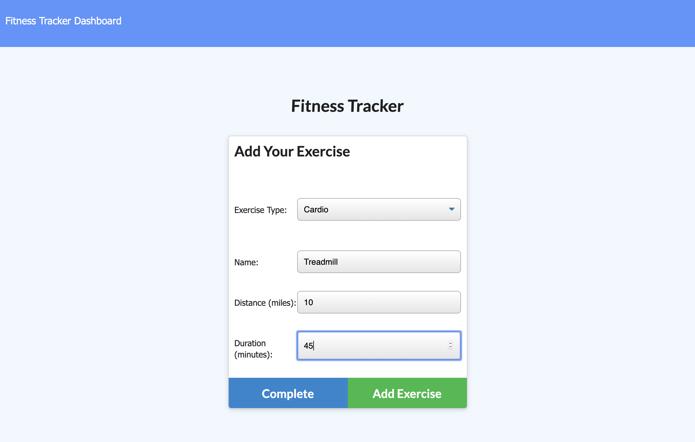
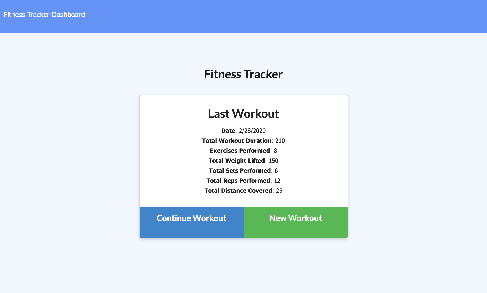
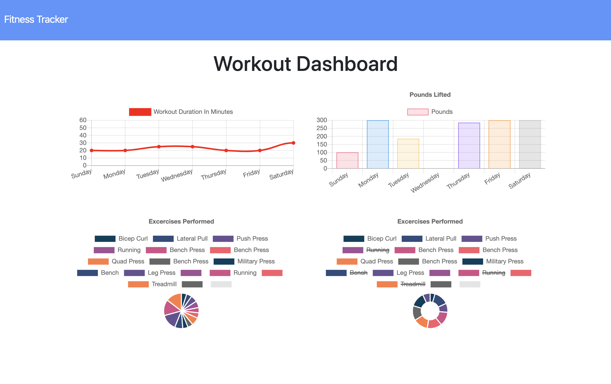

# Workout-Tracker
Nosql Homework: Workout Tracker

## Description

This app is a workout tracker. It was built using a Mongo database with a Mongoose schema and handles routes with Express.

When the user loads the page, they are given the option to create a new workout, or continue with their last workout.

The user is able to:

  * Add new exercises to a new workout plan.
  * Add exercises to a previous workout plan.
  * View multiple the combined weight of multiple exercises on the `stats` page.

## Business Context

A consumer will reach their fitness goals quicker when they track their workout progress.

## Deployed on Heroku

 [https://immense-peak-42868.herokuapp.com/](https://immense-peak-42868.herokuapp.com/)

## GitHub page

My GitHub page can be found here:

//: chriscrichter GitHub [https://github.com/chriscrichter/](https://github.com/chriscrichter/)

